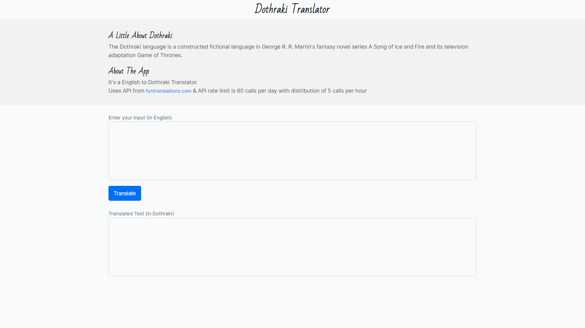

## neog.camp-week-3-lesson-4
### Javascript in the browser
---
### Using FETCH API 
#### Created a English to Dothraki Translation App using Fetch API.
#### API rate limit is 60 calls per day with distribution of 5 calls per hour.
##### API URL: (https://funtranslations.com/api/)    App URL: (https://funtranslations.com/api/)

## Build using 

1. Vanilla Javascript
2. Fetch API (fetching data)
3. CSS (styling)

#### Play & Enjoy, ThankYou